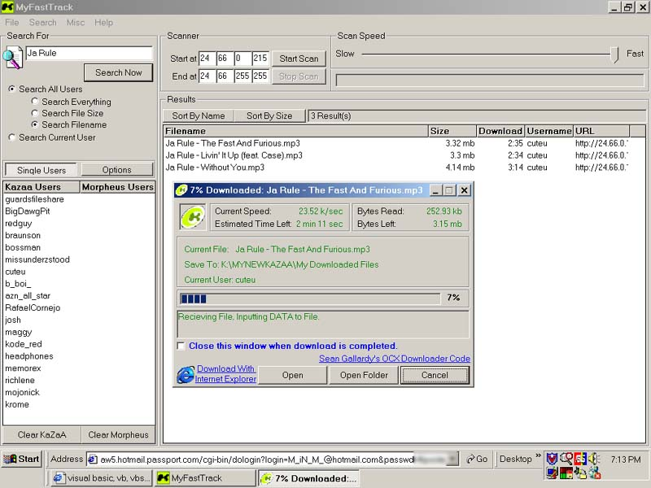



## Better KaZaA/Morpheus Program

### Description

This is a total revision of my contest winning version of kazaa... it uses flex grid control to show and sort your results. It displays an Estimated download time (based on the time the shared folder took to download). you can now search for filename, size or all topics. You can sort your results by name or size. It has a caching function built in to speed up search results. It has its own downloading feature (Allows you to play the song as it downloads). This downloader might be a bit hard to explain but i'll give it a shot. There are 2 source codes involved here. One main code which includes the searching area, and one code for downloading. You must compile the downloader code to a file called "DownloadFile.KMD" located in the same directory as your main code. This file is called when you request to download a file. I did this because if the main program froze for some reason, your download wouldn't stop since it is running independantly from the main program. (Thanks goes to Sean Gallardy for the Easy to use, downloader Active X control)

This code is also great to use now since many people i know (including myself) have been having trouble connecting to kazaa. With this, there is no connecting required. Just scan, search and download.

I wasn't gonna submit this one because it might make people a bit nervous having 2 source codes but i got a comment on my last one about the interface and the coding so i just thought i would show people how much further this program can be taken with a bit of time.

Check it out and leave some comments and/or tips that i can incorporate in later versions.
 
### More Info
 

             |
---                |---
**Submitted On**   |2002-03-05 19:36:12
**By**             |[James Gourley](https://github.com/Planet-Source-Code/PSCIndex/blob/master/ByAuthor/james-gourley.md)
**Level**          |Intermediate
**User Rating**    |4.9 (142 globes from 29 users)
**Compatibility**  |VB 6\.0
**Category**       |[Complete Applications](https://github.com/Planet-Source-Code/PSCIndex/blob/master/ByCategory/complete-applications__1-27.md)
**World**          |[Visual Basic](https://github.com/Planet-Source-Code/PSCIndex/blob/master/ByWorld/visual-basic.md)
**Archive File**   |[Better\_KaZ59966362002\.zip](https://github.com/Planet-Source-Code/james-gourley-better-kazaa-morpheus-program__1-32384/archive/master.zip)

